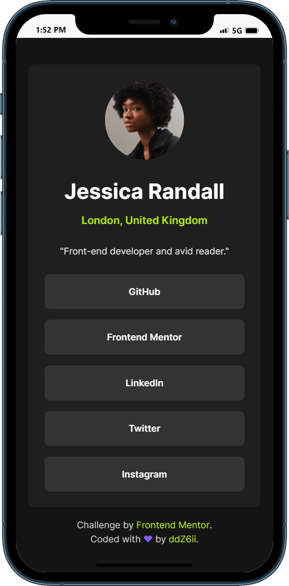
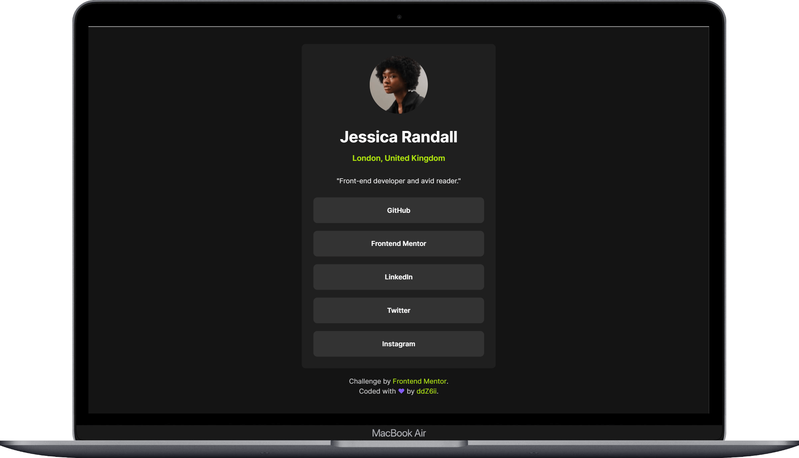

# Frontend Mentor - Social links profile solution

This is a solution to the [Social links profile challenge on Frontend Mentor](https://www.frontendmentor.io/challenges/social-links-profile-UG32l9m6dQ). Frontend Mentor challenges help you improve your coding skills by building realistic projects. 

## Table of contents

- [Overview](#overview)
  - [Screenshots](#screenshots)
  - [Links](#links)
- [Getting started](#getting-started)
- [My process](#my-process)
  - [Built with](#built-with)
  - [Deployed with](#deployed-with)
- [Author](#author)

## Overview

### The challenge

Users should be able to:

- See hover and focus states for all interactive elements on the page

### Screenshot

- Phone:
  

- Laptop/Desktop:
  

### Links

- Solution URL: [frontend-mentor-solution](https://www.frontendmentor.io/solutions/responsive-card-with-hover-and-focus-states-on-interactive-elements-FdLWaY0ezT)
- Live Site URL: [social-links-profile](https://social-links-profile-bice.vercel.app/)

## Getting started

Clone the project and run the following command:

```console
yarn install
```

This will initialize the project by installing all the required dependencies.

## My process

### Built with


- Semantic HTML5 markup
- Sass and BEM convention
- Flexbox
- CSS Grid
- Parcel bundler
- Mobile-first workflow

### Deployed with


## Author

- Github - [@ddZ6ii](https://github.com/ddZ6ii)
- Frontend Mentor - [@ddZ6ii](https://www.frontendmentor.io/profile/ddZ6ii)
- Linkedin - [@denis-dezest](https://www.linkedin.com/in/denis-dezest/)
